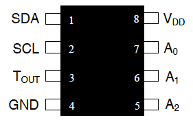

# Montage Rasperry PI PICO

Le DS1631 est un capteur de température, et est disponible en sample sur le site de Maxim, le fabriquant. Ce capteur s'interface facilement avec l'Arduino avec une liaison I2C. Il retourne une température avec une précision réglable allant jusqu'au 1/16ème de degré.

{ data-title="chip ds1631".custom-desc1" }
